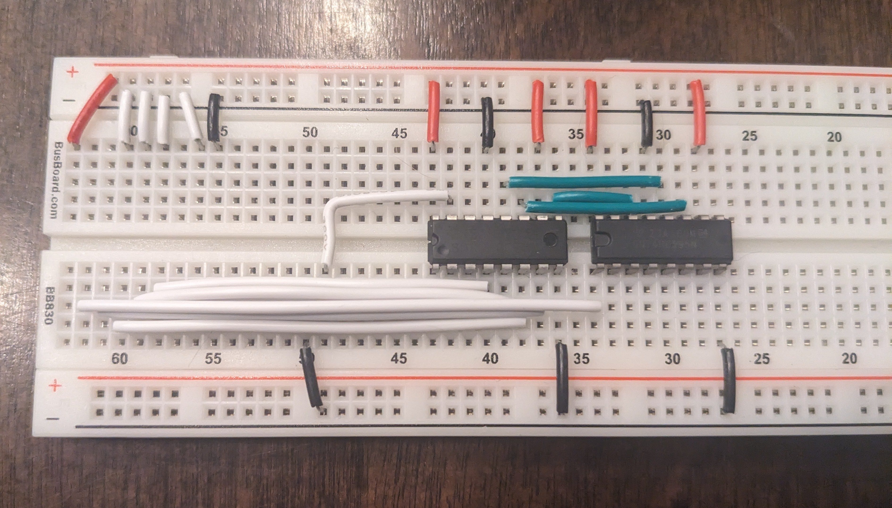
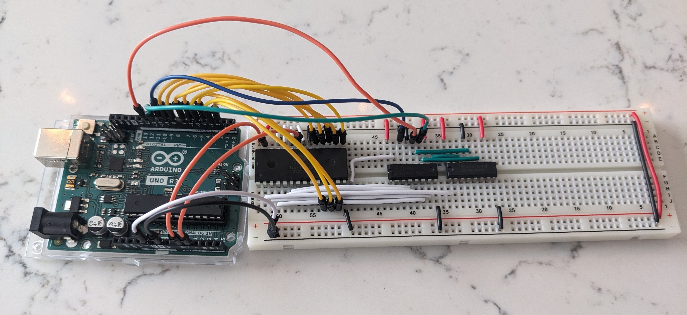
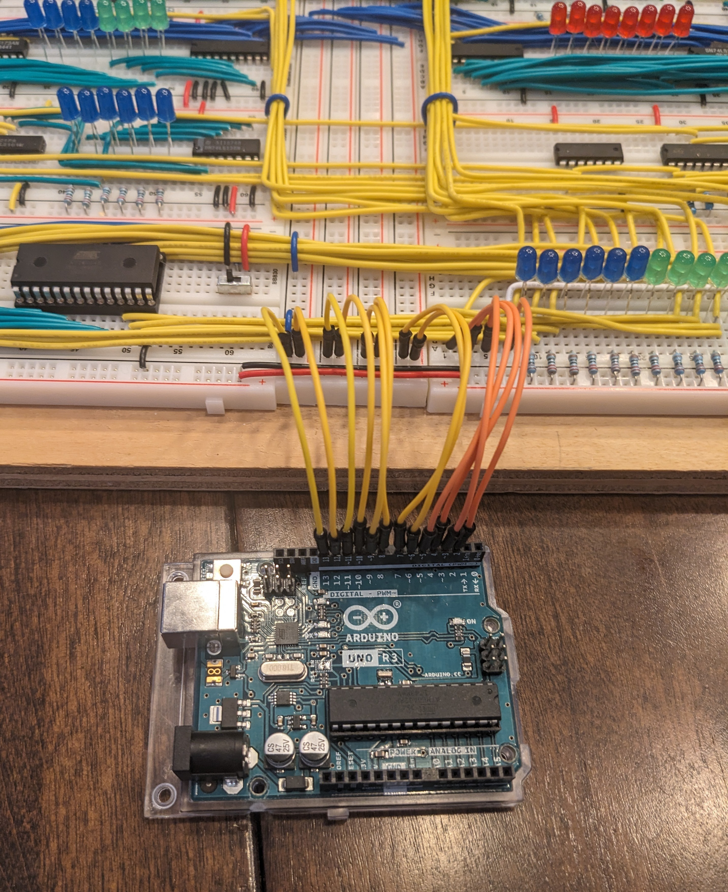
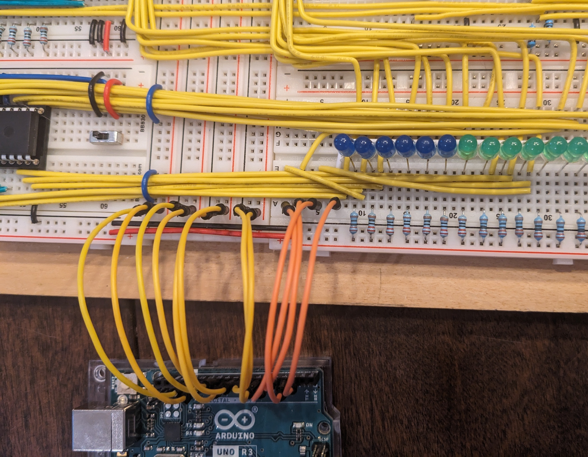

#  Arduino Programs

This area outlines the Arduino programs I used throughout the build. The assumption here is that you have an Arduino to use.

Below I've outlined the main programs, requirements, as well as some helpful notes for each.

Realistically, you probably shouldn't *tackle* the ROM programming until you're fairly certain what control signals you want your Control Unit to emit given specific inputs. This would necessarilly happen near the end of the build. Similarily, the RAM programming probably shouldn't be a priority until you've got your EEPROMs close to working.

## Display

This is the only aspect of the build where I think I *cheated* a little. In Ben Eater's original build (https://eater.net/8bit/output), he used four 7-segment displays along with a bunch of logic to produce output. I wanted to have something I could use to: a) troubleshoot easily; and, b) have multiple display modes (e.g. Hex, Binary, Decimal).

For example, I could tie `PIN 19` (`LATCH_MODE`) on the ATmega `LOW`, and the Display would continuously show what was on the bus (helpful for troubleshooting).

Requirements:
- Arduino for programming
- `ATmega328P` chip that will live on the build
- `1602A` 2-line display
- (optional) A push-button that could be used to switch modes

I would program the ATmega chip using the Arduino, and then put it on the board. It hasn't moved since.

Build info for the display can be found [here](/build/readme.md#display).

## EEPROM Programmer

Before programming these chips, you'll need to generate the actual ROM images. This can be done using the `generate_microcode.py` Python script (which assumes a bunch of other things). More details here: [Python](/python/readme.md#eeprom-programming)

I programmed each chip individually. Remove one from the board, program it, put it back, and repeat.

The `eeprom_programmer` folder contains the `microcode_images.h` file that was used for my project.

The sketch will prompt you to select which EEPROM you're programming.

Requirements:
- Arduino for programming
- Two EEPROM chips - I used `AT28C64B` chips
- The `microcode_images.h` file that holds the actual ROM images

## RAM Programmer

Similar to the EEPROM, you'll need to programs that can be run before you program the RAM chip. This also requires that the Control Unit EEPROMs be programmed (and preferably running properly).

Programs can be *compiled* using the `compile.py` Python script. More details here: [Python](/python/readme.md#compiling-programs)

The `ram_programmer` folder contains the `programs.h` file that was used for my project. It includes four test programs to ensure control signals are working as expected, and a couple *blinky light* programs for fun.

Requirements:
- Arduino for programming
- A RAM chip - I used `AS6C6264`
- Programs saved into `programs.h`
- Functional bus lines to read and write to the RAM chip
- Functional `CLK`, `/RI`, `/RO`, `/MI` lines to control program writing to the RAM chip

